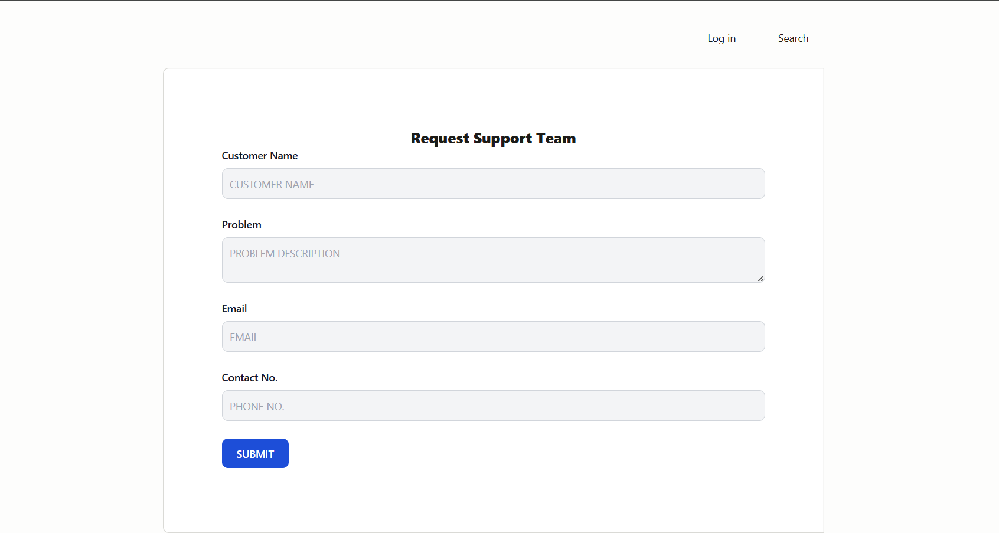
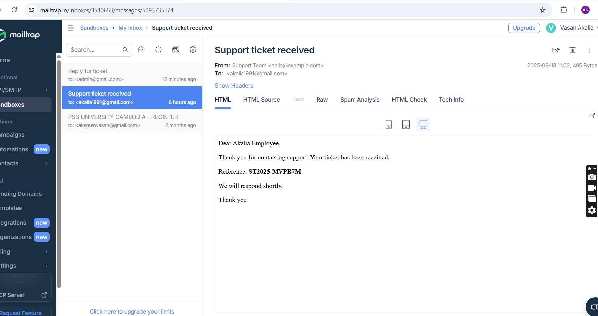
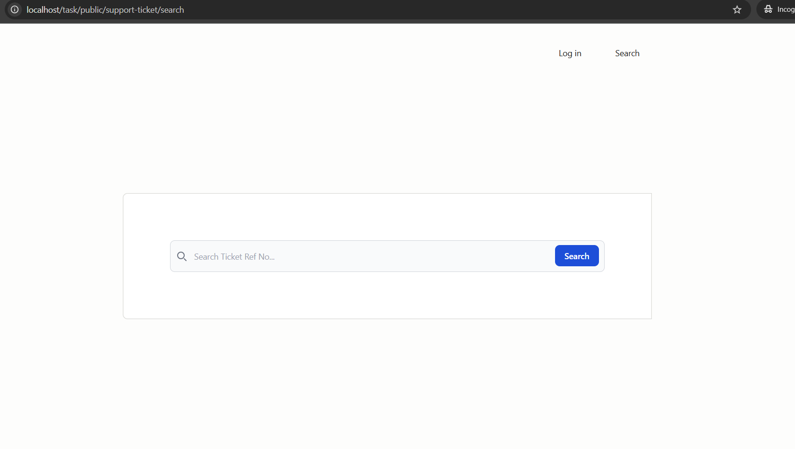
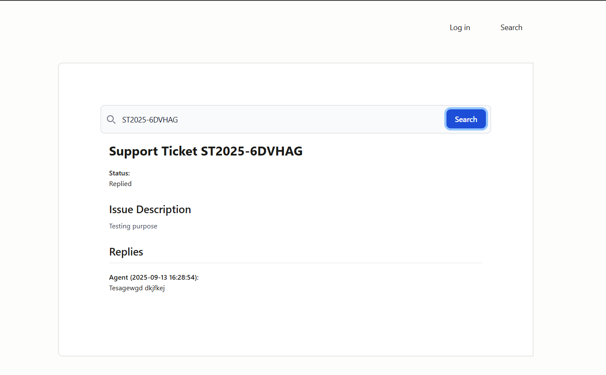
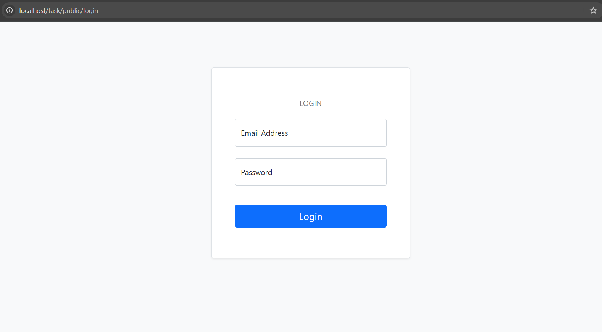
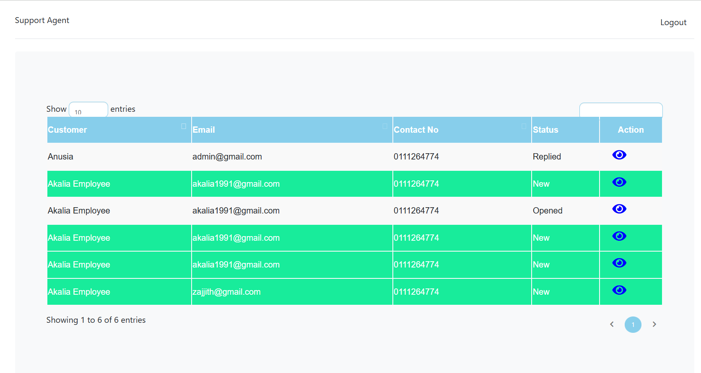
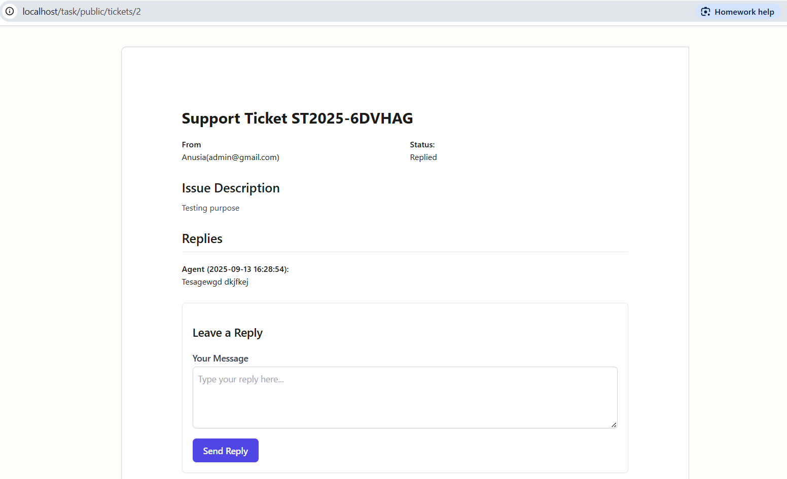
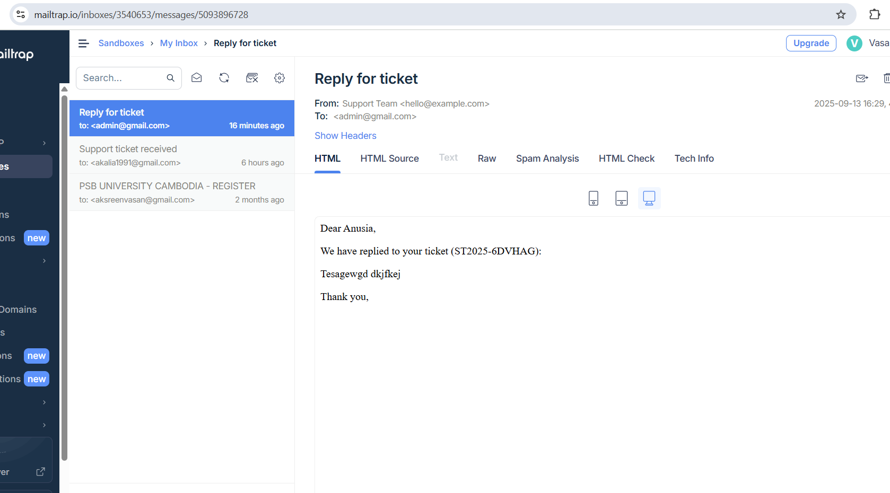

1.  Use the git clone command to clone the repository.
    git clone <repository_url> <folder_name>

2.  Run composer install to install PHP dependencies.
    composer update
3.  Duplicate the .env.example file and rename it to .env.
4.  Open the .env file and set your database connection details.
        DB_CONNECTION=mysql
        DB_HOST=127.0.0.1
        DB_PORT=3306
        DB_DATABASE=your_database_name
        DB_USERNAME=your_database_username
        DB_PASSWORD=your_database_password
5.  Generate an application key.
        php artisan key:generate
6.  Run database migrations to create tables.
        php artisan migrate
7.  populate the database with sample data.
        php artisan db:seed

8. finally run below commants
php artisan optimize
php artisan route:clear
php artisan serve

9. Agents can log in to the system using the following credentials:
    Email: agent@gmail.com
    password : 12345678

10. Emails can be viewed using Mailtrap

     

Screenshots
1. Screen for create Support tickts

2. Screen for acknowledgement email is sent to the customer’s email address after ticket details
are stored in the system

3. Customer search 

4. Search Result 

5. Agent Login Page

6. Screen for agent ticket list with pagination
 

7. Add reply page and view replies
 

8. Reply Notification mail

